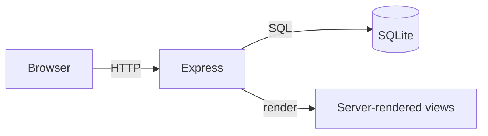

# Eduker Architecture

> [!warning] Draft
> This is a working draft. It will move to `status: published` once the SQLite schema lands.

## High level

A monolithic Express server serves server-rendered HTML and JSON APIs. SQLite is the single data store. The frontend is intentionally boring — server-rendered pages plus sprinkles of vanilla JS.

## Layered view

- **Routes** (`src/routes/`) — HTTP boundary, request validation.
- **Services** (`src/services/`) — business logic, transaction boundaries.
- **Repositories** (`src/repositories/`) — SQL, no business rules.
- **Domain** (`src/domain/`) — types and pure functions shared across services.
- **Views** (`views/`) — server-rendered templates (planned: HTMX + plain HTML).

## Data model (planned)

- `users` — instructors + learners, role column discriminates
- `courses` — title, description, owner (instructor), status
- `lessons` — course, order, content (markdown), video_url
- `quizzes` — lesson, passing_score
- `questions` — quiz, prompt, type (single-choice / multi-choice / free-form)
- `answers` — question, body, is_correct
- `attempts` — user, quiz, started_at, completed_at, score
- `attempt_answers` — attempt, question, answer (free-form: text)

## Cross-cutting

- **Auth** — see [RFC: Auth](./RFCs/Index.md) (not yet written).
- **Logging** — request-scoped structured logs (`req.log`).
- **Config** — env vars only; no `.env` files in the repo.

## Out of scope (for now)

- Caching layer (Redis) — premature at MVP.
- Async/queue — no background jobs yet.
- Multi-tenant — single deployment per company.
